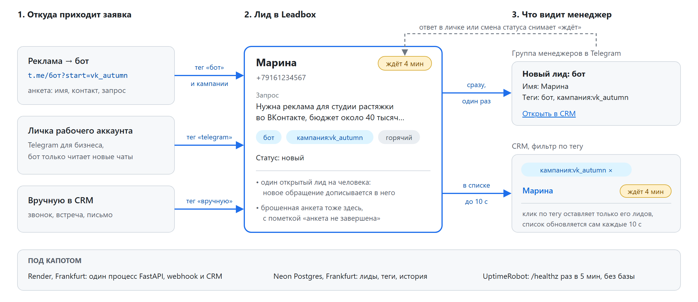

# Leadbox: заявки из Telegram в одной CRM

Как проверить: напишите боту [t.me/leadbox_demo_bot?start=jumpads_review](https://t.me/leadbox_demo_bot?start=jumpads_review) и ответьте на три вопроса, затем откройте [CRM](https://leadbox-ov2n.onrender.com), логин `demo`, пароль `leadbox-32b017`. Ваш лид будет первым в списке, с тегами `бот` и `кампания:jumpads_review`. Код, решения и диалоги с Claude Code: [github.com/alekseevpavel04/leadbox](https://github.com/alekseevpavel04/leadbox).

## Проблема и для кого

Агентство платит за рекламу, а заявки из Telegram приходят в бота и в личку менеджера, тонут в переписке, и не видно, какая кампания их привела. А лид остывает за минуты. Leadbox для менеджера, который разбирает заявки, и для того, кто решает, какой кампании добавить бюджет.

## Как это работает

*Схема: заявка из бота (тег кампании из ссылки), из лички рабочего аккаунта или вручную становится лидом с тегами, на человека один открытый лид. Менеджеру сразу уходит уведомление, в CRM лид виден за 10 секунд, клик по тегу фильтрует список. Ответ в личке или смена статуса снимает «ждёт».*

Лид создаётся сразу после /start, а шаг анкеты хранится в самом лиде: брошенная анкета видна, рестарт сервера ничего не теряет.

## Что в MVP, развилки и что за скобками

Все четыре пункта ТЗ. Сверх ТЗ: тег кампании из ссылки, уведомление в группу, статусы лида и счётчик «ждёт N мин». Имя и телефон это персональные данные: в приветствии бота строка согласия, CRM за паролем.

- **Личка через Telegram для бизнеса, а не user-клиент (Telethon).** Тому нужны постоянный процесс и сессия с полным доступом к аккаунту, а вход с IP дата-центра грозит ограничениями. Бот видит только выбранные чаты, только читает и отключается одной кнопкой.
- **Получатели только «Новые чаты».** Типы чатов в настройке складываются через ИЛИ, и «не из контактов» затянул бы старые переписки с незнакомцами.
- **Render free и Neon free.** `*.vercel.app` из РФ не открывается, onrender.com открывается. Render засыпает через 15 минут, отсюда пинг раз в 5 минут, и он не трогает базу: compute Neon без сна съел бы 0.25 CU × 744 ч ≈ 186 CU-ч при лимите 100.
- **Не делал:** экспорт CSV, нескольких менеджеров с ролями, ответ клиенту из CRM, ограничение попыток входа, ИИ внутри продукта. Для пути «сообщение боту, лид с тегом» они не нужны, а каждый за три дня добавил бы непроверенных экранов.
