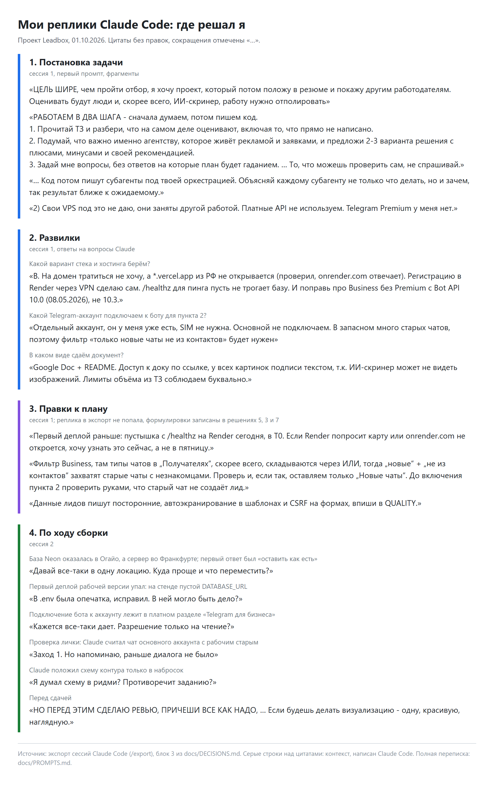

# Разбор

**Как делали.** Все решения принимал я, процесс контролировал я, за результат отвечаю я. Решения записаны моими формулировками в [DECISIONS](https://github.com/alekseevpavel04/leadbox/blob/main/docs/DECISIONS.md), план я вернул с четырьмя правками.

Инструмент: Claude Code. По моим решениям он писал код и тесты (их 283), готовил черновики текстов и схем и прогонял проверки, я проверял и утверждал каждый шаг. ТЗ я сначала обсудил с Claude в отдельной сессии, потом начал проект с чистого листа. Переписка дословно: [PROMPTS](https://github.com/alekseevpavel04/leadbox/blob/main/docs/PROMPTS.md).

Порядок: разбор ТЗ и развилки, план, пустышка на Render в первый же день (проверить доступ из РФ), бот и CRM, деплой, пункт 2, проверка глазами проверяющего, тексты.

Руками я проверил стенд со своего IP и с мобильного, прошёл путь ТЗ с телефона и подключил бота к рабочему аккаунту. Первый деплой упал: из-за опечатки в имени переменной на Render конфиг молча подставил локальный SQLite. Опечатку нашёл я, молчаливый откат убрали из кода.

**За неделю.**

- Ответ клиенту из карточки: сейчас менеджер отвечает в Telegram.
- Несколько менеджеров, роли и лимит попыток входа: сейчас один демо-логин.
- Лиды из форм рекламных кабинетов: трафик идёт не только в Telegram.
- Отчёт по кампаниям: лиды и доля дошедших до конца анкеты, данные уже есть.

*Мои ключевые реплики: постановка («сначала думаем, потом пишем код»), развилки (Render вместо Vercel, который из РФ не открывается; пинг без базы; Bot API 10.0 вместо 10.3), правки к плану и решения по ходу сборки. Видно, как фильтр «новые не из контактов» стал «только новые».*
